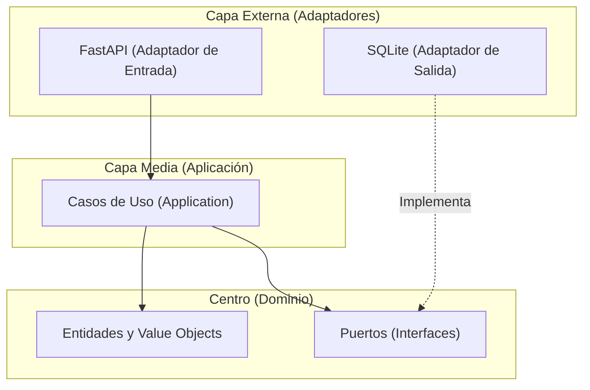
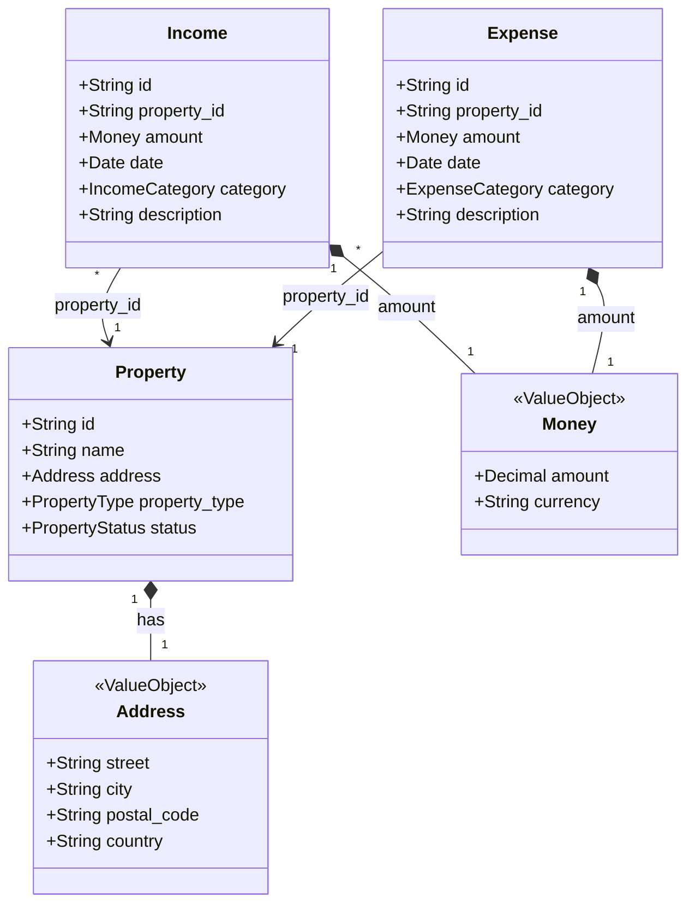

# Recapitulación 01: Arquitectura del Backend y Progreso

Este documento resume lo que hemos construido hasta ahora en el backend de Gestión de Alquileres, con el objetivo de consolidar el aprendizaje sobre cómo se estructura un software profesional usando **Arquitectura Hexagonal (Ports & Adapters)** y **Domain-Driven Design (DDD)**.

---

## 1. El Concepto Principal: Arquitectura Hexagonal

La regla de oro de la Arquitectura Hexagonal es la **Dirección de las Dependencias**. El código se organiza en capas concéntricas, y las dependencias *siempre* deben apuntar hacia el centro (el Dominio). Las capas externas no pueden ser importadas por las capas internas.



### El Centro: Dominio (`backend/domain/`)
Es el corazón del software. No sabe nada de bases de datos, ni de JSON, ni de HTTP.
- **Value Objects** (`value_objects.py`): Conceptos inmutables como `Money` (Dinero) y `Address` (Dirección). Si cambias un dato, es un objeto nuevo. Nos aseguran que nunca tendremos "dinero negativo" flotando por el sistema.
- **Entidades** (`entities.py`): Conceptos con identidad única, como `Property` o `Income`. Tienen un ciclo de vida y un estado (ej. de Disponible a Alquilada).
- **Puertos** (`ports.py`): Contratos o Interfaces. El dominio dice: *"Necesito un lugar donde guardar propiedades, no me importa si es un disco duro, SQLite o la nube, pero tiene que cumplir estas reglas"*.

**Visualización del Dominio (UML):**


### La Capa Media: Casos de Uso (`backend/application/`)
Orquestan la lógica. Responden a la pregunta: *¿Qué operaciones permite hacer esta aplicación?*
- Aquí viven los **Use Cases** (`use_cases.py`), como `CreatePropertyUseCase` o `RecordIncomeUseCase`. 
- Un caso de uso toma datos básicos, valida el negocio, llama a los repositorios a través de los **Puertos** y guarda el resultado. Siguen sin saber que estamos en la web.

### La Capa Externa: Adaptadores (`backend/api/` y `backend/adapters/`)
Conectan nuestra aplicación abstracta con el mundo real.
- **Adaptadores de Salida (Secondary Adapters)**: `sqlite_adapter.py`. Aquí se implementan los Puertos usando la tecnología elegida (SQLite y sentencias SQL).
- **Adaptadores de Entrada (Primary Adapters)**: `routes/` (FastAPI). Reciben peticiones HTTP, convierten el JSON en variables de Python usando DTOs (Data Transfer Objects en `schemas.py`), y llaman a los Casos de Uso. Luego devuelven un 201 Created o 400 Bad Request.

---

## 2. El Rol de la Base de Datos (SQLite)

**La buena noticia: ¡La base de datos ya está implementada y funcionando!** 
No necesitas instalar servidores complejos como MySQL o PostgreSQL. Hemos utilizado **SQLite**, que es un motor de base de datos completo y muy potente, pero que guarda toda su información en un simple archivo local dentro de nuestro proyecto (en `data/rental.db`). 

### ¿Cómo funciona en nuestra Arquitectura?
En la Arquitectura Hexagonal, la base de datos **es un detalle externo** (un *Adaptador de Salida*). El Dominio (el cerebro de la app) no sabe que existe SQLite. Solo sabe que hay "Puertos" (Interfaces) con métodos como `save()` o `find_by_id()`.

1. **La Implementación Técnica**: En el archivo `backend/adapters/sqlite_adapter.py`, hemos escrito el código que "habla" SQL. Cuando la aplicación arranca, este archivo automáticamente crea el archivo `rental.db` y construye las tablas necesarias (`properties`, `incomes`, `expenses`) si no existen.
2. **Inyección de Dependencias**: Cuando entra una petición web, FastAPI (el *Adaptador de Entrada*) crea la conexión al archivo `.db`, crea el adaptador `SQLiteIncomeRepository` y se lo inyecta (se lo pasa) al Caso de Uso. 
3. **Persistencia (Guardado Mágico)**: El Caso de Uso ejecuta su lógica de negocio y, al final, llama a `repo.save(income)`. En ese momento, nuestro adaptador traduce la entidad de Python pura a una sentencia `INSERT INTO incomes ...` y la guarda permanentemente en el archivo.

**Resumen**: Ya tienes una base de datos real y persistente operando de fondo. Si en un futuro (hipotético) la aplicación crece tanto que necesitas PostgreSQL en la nube, **tu núcleo de negocio (Dominio y Casos de Uso) no cambiaría ni una sola línea**. Solo tendrías que crear un nuevo archivo `postgres_adapter.py` que cumpla con los mismos Puertos. ¡Esa es la magia de esta arquitectura!

---

## 3. ¿Cómo se conecta todo en una Petición HTTP?

Imagina que el Frontend (que construiremos pronto) envía una petición para registrar un ingreso. Este es el viaje de los datos:

1. **El Frontend envía:** `POST /api/incomes` con un JSON (`{"amount": 750, ...}`).
2. **FastAPI (Adaptador de Entrada):** Recibe la petición en `routes/incomes.py`. Valida que el JSON tiene el formato correcto usando `IncomeCreate` (Pydantic DTO en `schemas.py`).
3. **Inyección de Dependencias:** FastAPI le da al enrutador el `SQLiteIncomeRepository` (el Adaptador de Salida).
4. **El Caso de Uso entra en acción:** FastAPI crea un `RecordIncomeUseCase` pasándole el repositorio, y llama a su método `execute()`.
5. **El Dominio trabaja:** El caso de uso crea entidades puras de Python (`Money`, `Income`). 
6. **Se guarda la información:** El caso de uso le dice al repositorio `repo.save(income)`.
7. **SQLite (Adaptador de Salida):** Extrae los strings y números de las entidades (ej. `str(income.amount.amount)`) y hace un `INSERT INTO incomes` en el disco duro.
8. **La Respuesta:** El caso de uso termina. FastAPI toma la entidad `Income` devuelta, la traduce a un DTO `IncomeResponse`, y la escupe como JSON HTTP 201 de vuelta al Frontend.

---

## 4. Rincón del Estudiante: ¿Cómo se conecta el Caso de Uso con el Adaptador?

Una duda muy común es: **¿Cómo sabe el Caso de Uso (que está en el centro) qué base de datos estamos usando, si no importamos SQLite en él?**

La respuesta se divide en tres conceptos clave: **un Puerto, un Repositorio y la Inyección de Dependencias**.

### 1. ¿Qué es un "Repository" (Repositorio)?
Un repositorio es un patrón de diseño que simula ser una **colección en memoria** (como una lista gigante de Python) de nuestras entidades, pero que por detrás persiste la información en un almacenamiento real (como SQLite). 

En vez de escribir consultas SQL dentro de la lógica del negocio, le pedimos al repositorio que haga el trabajo sucio (`save(property)`, `find_by_id(id)`).

### 2. El Contrato: El Puerto (`backend/domain/ports.py`)
El dominio define un **Puerto** (que en Python es una clase abstracta o *Abstract Base Class*):

```python
class PropertyRepository(ABC):
    @abstractmethod
    def save(self, property: Property) -> None:
        pass
    
    @abstractmethod
    def find_by_id(self, property_id: str) -> Property | None:
        pass
```

El Caso de Uso en `application/use_cases.py` recibe este puerto en su constructor:

```python
class CreatePropertyUseCase:
    # Exigimos recibir algo que cumpla con el contrato de PropertyRepository
    def __init__(self, property_repo: PropertyRepository) -> None:
        self.property_repo = property_repo

    def execute(self, ...) -> Property:
        # El caso de uso llama a .save() confiando ciegamente en que el puerto lo tiene
        ...
        self.property_repo.save(prop)
```

**Aquí está el truco**: El caso de uso solo conoce la interfaz abstracta `PropertyRepository`. No sabe cómo se guarda la propiedad, solo sabe que *se guarda*.

### 3. El Adaptador (`backend/adapters/sqlite_adapter.py`)
El adaptador es la clase concreta que implementa el puerto y escribe en SQLite:

```python
class SQLitePropertyRepository(PropertyRepository):  # <-- Hereda e implementa el puerto
    def __init__(self, connection: SQLiteConnection) -> None:
        self._conn = connection.connection

    def save(self, property: Property) -> None:
        # Aquí sí escribimos la consulta SQL real
        self._conn.execute("INSERT OR REPLACE INTO properties ...", (...))
        self._conn.commit()
```

### 4. El Pegamento: Inyección de Dependencias (FastAPI)
¿Quién une el Caso de Uso con el Adaptador SQLite? **FastAPI en la capa API.**

Cuando un usuario llama a la API, el archivo de rutas instanciará el adaptador SQLite y se lo inyectará al caso de uso:

```python
@router.post("")
def create_property(
    body: PropertyCreate,
    property_repo: SQLitePropertyRepository = Depends(get_property_repo) # 1. FastAPI obtiene el adaptador SQLite
):
    # 2. Se inyecta (se pasa) el adaptador SQLite al caso de uso
    use_case = CreatePropertyUseCase(property_repo) 
    
    # 3. Se ejecuta. El caso de uso llamará a .save() y se ejecutará el código SQL del adaptador
    return use_case.execute(...)
```

A esto se le llama **Inversión de Dependencias**: el caso de uso define las reglas (el Puerto) y es el adaptador externo el que tiene que adaptarse a él. El caso de uso nunca depende del adaptador; el adaptador depende del caso de uso.

---

## 5. Rincón del Estudiante: Estructura de Tests (Unitarios vs. Integración)

Para garantizar un desarrollo ágil y profesional, hemos organizado la suite de pruebas dividiendo los tests en dos grandes categorías en la raíz de la carpeta `tests/`:

1. **Tests Unitarios (`tests/unit/`)**:
   - Prueban funciones, clases y lógica de negocio en total aislamiento.
   - Utilizan repositorios ficticios en memoria (`InMemoryPropertyRepository`, etc.).
   - No tienen dependencias externas (no tocan base de datos ni red).
   - Son extremadamente rápidos (se ejecutan en milisegundos).
   - Su estructura interna sigue en espejo a la de producción (ej: `tests/unit/backend/domain/`).

2. **Tests de Integración (`tests/integration/`)**:
   - Comprueban la comunicación entre múltiples componentes del sistema o con agentes externos reales.
   - En nuestro caso, los tests de `adapters/` interactúan con una base de datos SQLite real (en memoria) para validar las consultas SQL.
   - Los tests de `api/` levantan el cliente web de pruebas (`TestClient`) para validar el enrutamiento HTTP y el flujo completo desde el endpoint hasta la base de datos.
   - Requieren configuración especial (fixtures de base de datos) y se gestionan por separado en `tests/integration/conftest.py`.

Esta separación evita que los tests de integración lentos ralenticen el bucle rápido de desarrollo de los tests unitarios.

---

## 6. SDD y Harness: Nuestro Flujo de Trabajo

El proyecto ha fluido sin caos porque hemos seguido la **Definición de Software Desencadenada (SDD)**, controlada por las reglas de nuestro `agents.md` (el harness).

1. **Paso 1: Especificación (`design.md`)**. Pensamos el problema, los contratos y los esquemas antes de escribir una línea de código. Siempre incluyendo un *Rincón del Estudiante* para asentar conceptos.
2. **Paso 2: Plan de Implementación**. Un documento paso a paso de los archivos a crear.
3. **Paso 3: Subagentes (Implementer)**. Ejecutan el código en lotes precisos.
4. **Paso 4: Verificación (Reviewer)**. Prueban exhaustivamente que todo encaje.

---

## 7. Hacia dónde vamos (F-03)

Hasta el momento, tenemos un "motor" robusto y testeado, pero el usuario no tiene cómo interactuar con él (salvo por herramientas técnicas como Swagger). 

**Siguiente paso: El Frontend.**
- Construiremos una SPA (Single Page Application) usando **React** y **TypeScript**.
- El Frontend se convertirá en un "Cliente HTTP" más. Usará llamadas `fetch` o `axios` para comunicarse con la API (F-02) que a su vez moverá el motor (F-01).
- En el frontend también aplicaremos buenas prácticas de arquitectura: separaremos componentes visuales, hooks de estado y servicios de llamada a la API.
